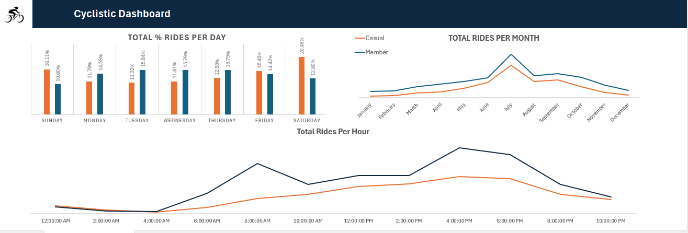
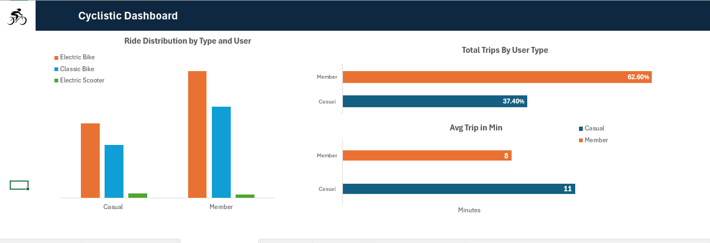
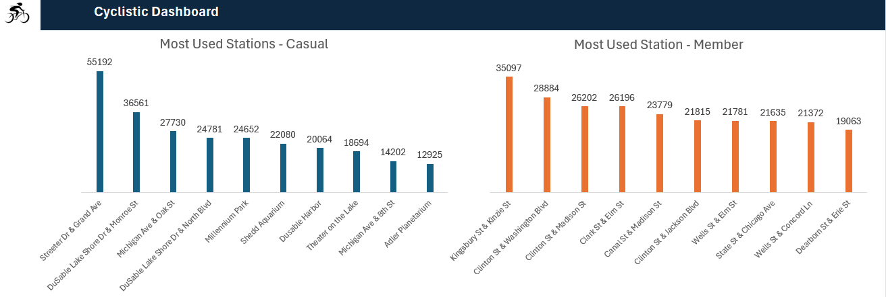

```{r setup, include=FALSE}
# Load required libraries
library(dplyr)
library(readr)
library(ggplot2)
library(tidyverse)
library(lubridate)
```

# Introduction

Cyclistic is a bike-sharing service based in Chicago, offering both casual passes and annual memberships.
This project analyzes the riding behavior of casual riders versus annual members, with the goal of identifying strategies to convert casual riders into members.

Annual members provide more consistent revenue, so understanding casual riders’ distinct behaviors will help Cyclistic design targeted initiatives—such as promotions, pricing strategies, and loyalty programs—that support growth, profitability, and customer retention.

```{r read_file}
rides_df <- readRDS("~/rides_df.rds")
head(rides_df)
colnames(rides_df)
```

# Project Charter 

### Objective

Identify strategies to convert casual riders into annual members.

### Stakeholders

- Lily Moreno – Director of Marketing  
- Marketing Analytics Team  
- Cyclistic Executive Team 

### Deliverables

*Project Charter*

*Cleaned Dataset (July 2024 – July 2025)*

*Exploratory Data Analysis (EDA)*

*Final Report*

# Data Collection

**Source**: Cyclistic’s publicly available bike-share trip data via AWS.
**Access**: Downloaded 12 monthly CSV files, merged using SQL.
**Timeframe**: July 2024 – July 2025

```{r}
min(rides_df$start_date)
max(rides_df$start_date)
```

## Size and Structure

**Original**: 6,360,462 rows × 15 columns (~1.4 GB)
**Cleaned RDS file**:
```{r}
file.info("~/rides_df.rds")$size / 1024   # size in KB
dim(rides_df)
```

# Data Cleaning

*Import the data in SQL and 


### Missing values

* Start Station Name/ID: 1,262,353
* End Station Name/ID: 1,300,991 
* End Latitude/Longitude: 7,001 


### Steps taken 
* Dropped original started_at & ended_at columns after splitting into date and time.
* Extracted:
**start_date, start_time**
**end_date, end_time**

* No duplicates found.

# Exploratory Data Analysis (EDA)

### Overall Trips
```{r}
total_trips <- nrow(rides_df)
total_trips
```

### Trips per User (with visualization)

```{r}
Trips_per_user <- rides_df %>% count(member_casual, name="Trips")

ggplot(Trips_per_user, aes(y=Trips, x="", fill=member_casual)) + 
  geom_col() + 
  coord_polar(theta="y") + 
  labs(title="Trips by User Type") + 
  theme_void()

```


### Average Trip Duration

```{r}
avg_trips <- rides_df %>%
  mutate(duration = as.numeric(difftime(end_time, start_time, units="mins"))) %>%
  summarise(Avg_duration = round(mean(duration, na.rm=TRUE), 2))

avg_trips
```

### Monthly & Hourly Trends
```{r}
  Month_trends <- rides_df %>% 
  mutate(Year = year(start_date), 
         Month = month(start_date)) %>% 
  count(Year, Month, name = "Trips") %>% 
  arrange(Year, Month) %>%
  mutate(Date = ymd(paste(Year, Month, "01", sep = "-")))   # new monthly date column

ggplot(Month_trends, aes(x = Date, y = Trips)) +
  geom_line(color = "steelblue", size = 1) +
  geom_point(color = "darkblue", size = 2) +
  labs(title = "Monthly Trips Trend",
       x = "Month",
       y = "Number of Trips") +
  scale_x_date(date_labels = "%b %Y", date_breaks = "1 month") +
  theme_minimal() +
  theme(axis.text.x = element_text(angle = 45, hjust = 1))
```

```{r}
hour_trend <- rides_df %>% 
  mutate(Hour = hour(start_time)) %>% 
  count(Hour, name="Trips") %>% 
  arrange(desc(Trips))

hour_trend


```

# Analysis

### Trips per User & Bike Type

```{r}
Trips_Per_user_bike <- rides_df %>% 
  count(member_casual, rideable_type, name = "Trips")

ggplot(Trips_Per_user_bike, aes(x = rideable_type, y = Trips, fill = member_casual)) +
  geom_bar(stat = "identity", position = "dodge") +
  labs(title = "Trips by User and Bike Type",
       x = "Ride Type",
       y = "Number of Trips") +
  theme_minimal()

```

### Average Trip per User
```{r}
avg_per_user <- rides_df %>% 
  mutate(duration = as.numeric(difftime(end_time, start_time, units="mins"))) %>% 
  group_by(member_casual) %>% 
  summarise(avg_duration = round(mean(duration, na.rm=TRUE),2))

avg_per_user
```

### Month Trends by User

```{r}
Month_trends_user <- rides_df %>% 
  mutate(Year=year(start_date), Month=month(start_date, label=TRUE, abbr=TRUE)) %>% 
  group_by(member_casual, Year, Month) %>% 
  summarise(Trips=n(), .groups="drop") %>% 
  pivot_wider(names_from=member_casual, values_from=Trips, values_fill=0) %>% 
  arrange(Year, Month)

Month_trends_user
```

### Peak Hours by User

```{r}
peak_hours_user <- rides_df %>% 
  mutate(hour = hour(start_time)) %>% 
  group_by(member_casual, hour) %>% 
  summarise(trips = n(), .groups = "drop") %>% 
  # Create a dummy datetime just for pretty labels
  mutate(hour_time = as.POSIXct(sprintf("%02d:00", hour), format = "%H:%M"))

ggplot(peak_hours_user, aes(x = hour_time, y = trips, color = member_casual)) +
  geom_line(size = 1) +
  geom_point(size = 2) +
  scale_x_datetime(date_labels = "%H:%M", date_breaks = "1 hour") +
  labs(title = "Peak Hours by User Type",
       x = "Hour of Day",
       y = "Number of Trips",
       color = "User Type") +
  theme_minimal() + 
  theme(axis.text.x = element_text(angle = 45, hjust = 1))


```


# Visualization








# Results & Findings

## Insights

1.	Trip Distribution by Membership: Members account for approximately 62% of total trips. Casual users likely ride occasionally—during weekends, holidays, or special events.
 
2.	Trip Duration: Casual users take slightly longer trips, averaging 11 minutes compared to 8 minutes for members, suggesting casual users tend to take longer, recreational rides.

3.	Vehicle Preferences: Electric bikes are the most popular for both members and casual users, followed by classic bikes. Electric scooters have low usage, indicating an opportunity to boost their adoption.

4.	Daily Usage Patterns: Casual users ride more on weekends (Friday–Sunday), while members ride consistently on weekdays, likely for commuting or errands.

5.	Monthly Trends: Trips peak during summer (June–September) and drop from October through May, reflecting seasonal usage patterns.

6.	Hourly Trends: Members show high usage during commute hours (6–8 AM and 4–6 PM), whereas casual users peak in the late afternoon (around 4 PM), consistent with recreational use.

7.	Popular Stations: Casual users primarily use Streeter Dr & Grand Ave, while members favor Kingsbury St & Kinzie St.


## Recommendations 

1.	Promote Electric Scooters: Offer discounts or incentives to encourage scooter usage. Collect user feedback to improve the scooter model for better adoption.

2.	Target Casual Users for Membership: Launch campaigns highlighting benefits of annual subscriptions, such as cost savings, health advantages, and environmental impact. Encourage casual users to use bikes for commuting, not just recreation.

3.	Highlight Financial Benefits: Provide clear comparisons showing how much casual users can save by subscribing annually.

4.	Advertising at High-Traffic Stations: Increase marketing efforts at the top five stations used by casual riders to capture more attention and encourage repeat usage.

5.	Seasonal Campaigns: Design promotions targeting summer months to maximize usage during peak season, and consider off-season incentives to maintain engagement during slower months.

6.	Time-Based Offers: Introduce happy-hour discounts or time-based incentives during non-peak hours for casual users to balance station usage and vehicle demand.

7.	Optimize Fleet Composition: Since electric bikes are highly preferred, ensure adequate availability while monitoring electric scooter performance to adjust inventory and improve user experience.


# Conclusion
  
  The analysis of Cyclistic’s trip data over the past 12 months highlights clear differences between   casual riders and annual members. Members consistently generate the majority of trips, typically for   shorter durations and during weekday commuting hours, reflecting their role as regular users. Casual   riders, on the other hand, ride less frequently but take longer trips, often during weekends and      afternoons, indicating more recreational usage.
  
  These insights confirm that casual riders represent a strong opportunity for conversion into          members. By addressing their preferences—such as promoting cost savings for frequent rides,           targeting recreational users with seasonal offers, and improving access to popular                    stations—Cyclistic can design marketing strategies that increase membership rates while supporting    operational efficiency.
  
  Overall, the findings emphasize the importance of tailoring campaigns to rider behavior. Focusing on  converting casual riders into annual members not only boosts revenue stability but also strengthens   customer loyalty, ensuring Cyclistic’s long-term growth and competitiveness in the bike-share market.


